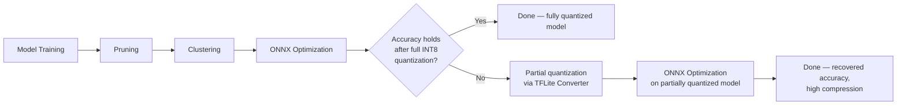
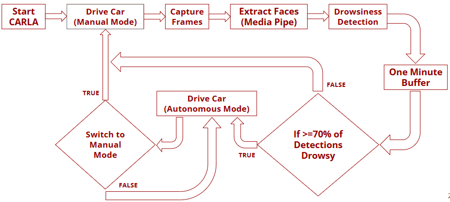

# Edge-AI Model Optimization for Real-Time Driver Drowsiness Detection

A model compression and deployment pipeline for driver drowsiness detection, designed for real-time inference on resource-constrained edge/embedded hardware. This repo covers the **deep learning and edge-AI side** of a larger hardware-software co-design project — model design, benchmarking, a hybrid TFMOT + ONNX optimization pipeline, and a closed-loop CARLA safety intervention system.

🔗 **[Run the notebook live on Kaggle](https://www.kaggle.com/code/rogaldorn7/drowsiness-detection-model-optimization)** &nbsp;|&nbsp; 🎥 **[Watch the closed-loop system demo](#carla-closed-loop-safety-system)**

> **Scope note:** This project was split across two repositories by design. This repo covers model training, optimization, and the CARLA closed-loop system. The RISC-V/FPGA hardware deployment, TVM cross-compilation, and custom convolution accelerator were built by teammates and live at [Harikheshav/Drowsiness-Detection](https://github.com/Harikheshav/Drowsiness-Detection). Together they form one system, described in full in the [project report](./report).

## Key Result

**MobileNetV3 Small**, after the hybrid optimization pipeline, delivered the best software-side balance for real-time deployment:

| Metric | Original | Optimized |
|---|---|---|
| Accuracy | 99.14% | **96.88%** |
| Raw model size | 31.20 MB | **3.18 MB** |
| Throughput | 24.1 img/s | **80.38 img/s** |
| Latency | 41.54 ms | **12.44 ms** |

That's an **8.7x reduction in raw model size** and a **3.3x latency improvement**, while retaining real-time-viable accuracy.

## The Problem

Vision-based drowsiness detection works well in principle, but deploying it on embedded edge hardware runs into memory, compute, and latency constraints. Naive compression techniques (pruning, quantization) tend to trade off accuracy for size in unpredictable ways — this project benchmarks that trade-off space directly and engineers around its failure modes.

## Optimization Pipeline

Two standard compression strategies were tried first, and both failed in complementary ways:

- **TFMOT pipeline** (pruning → clustering → quantization): 10.7x size reduction, but a 15.46x throughput degradation — unusable for real-time inference.
- **ONNX pipeline** (MLIR optimization → simplification → static INT8 quantization): ~8x throughput improvement, but full INT8 quantization collapsed accuracy from ~99% to ~55% on most architectures.

This motivated a **hybrid, conditional pipeline**:



If full static quantization holds accuracy above a threshold, the pipeline terminates there. If it collapses (as it did for most MobileNet variants), the pipeline falls back to partial quantization before re-applying ONNX optimization — recovering accuracy while still achieving strong compression.

## Benchmark Results

Five architectures were trained and evaluated end-to-end through this pipeline:

| Architecture | Accuracy | Raw Size | Throughput | Latency | Quantization Path |
|---|---|---|---|---|---|
| RTDD (IEEE) | 99.79% | 28.13 MB | 7.06 img/s | 141.63 ms | Full INT8 |
| ResNet-18 | 99.79% | 10.72 MB | 76.44 img/s | 13.08 ms | Full INT8 |
| **MobileNetV3 Small** | **96.88%** | **3.18 MB** | **80.38 img/s** | **12.44 ms** | Partial (fallback) |
| MobileNetV3 Large | 100.00% | 6.05 MB | 45.43 img/s | 22.02 ms | Partial (fallback) |
| MobileNetV2 | 95.31% | 64.07 MB | 15.60 img/s | 64.12 ms | Partial (fallback) |

ResNet-18 was the most robust to full static quantization; MobileNet-based architectures were more accuracy-sensitive and needed the partial-quantization fallback. MobileNetV3 Small came out best on the overall throughput/latency/size balance for edge deployment.

Full per-stage tables (raw → pruned → clustered → quantized) are in the [report](./report).

## CARLA Closed-Loop Safety System

A real-time closed-loop intervention system was built in the CARLA simulator to demonstrate the model in a driving context:



- Face detection via MediaPipe's `face_detector.tflite` (swapped in for the heavier MTCNN used in prior work, cutting pre-processing latency).
- A 1-minute rolling buffer of drowsiness predictions.
- A 70% drowsy-prediction threshold triggers automatic handoff to CARLA's Traffic Manager for autonomous safe-driving mode.
- Manual override support to resume driver control, which resets the monitoring cycle.

### Demo

A practical demonstration of the classification-to-actuation pipeline and autonomous state transitions:

[](https://your-video-link-here.com)

*(Click to watch — shows the system detecting drowsiness, handing off to autonomous mode, and manual override in action.)*

## Repository Structure

```
├── report/                          # Full project report (PDF)
├── notebooks/
│   └── edge-ai-hybrid-optimized-drowsiness-detection.ipynb   # Training + hybrid optimization pipeline
├── results/
│   ├── benchmark_tables.md          # Full per-architecture, per-stage results
│   └── figures/                     # Throughput/accuracy/latency comparison charts + demo thumbnail
├── carla_integration/               # Closed-loop safety intervention system
└── requirements.txt
```

## Running the Pipeline

The optimization pipeline is also hosted as a live Kaggle notebook (recommended if you want to run it directly against the dataset without local setup):

**[Kaggle: Drowsiness Detection Model Optimization](https://www.kaggle.com/code/rogaldorn7/drowsiness-detection-model-optimization)**

To run locally:

```bash
git clone https://github.com/<your-username>/drowsiness-detection-edge-ai-optimization.git
cd drowsiness-detection-edge-ai-optimization
pip install -r requirements.txt
jupyter notebook notebooks/edge-ai-hybrid-optimized-drowsiness-detection.ipynb
```

Dataset used: [Driver Drowsiness Dataset (DDD)](https://www.kaggle.com/datasets/ismailnasri20/driver-drowsiness-dataset-ddd/data) — Nasri, 2022.

## Related Work

This project builds on and identifies gaps in:
- Mousavikia et al., *Instruction Set Extension of a RISC-V Based SoC for Driver Drowsiness Detection*, IEEE Access, 2022 — no multi-modal sensing beyond camera input.
- Reddy et al., *Real-Time Driver Drowsiness Detection for Embedded System Using Model Compression of DNNs*, CVPRW 2017 — no pruning/clustering/quantization beyond distillation.
- Dosovitskiy et al., *CARLA: An Open Urban Driving Simulator*, CoRL 2017 — no dedicated drowsiness-detection framework, motivating the closed-loop system here.

## Author

**[Your Name]** — Deep learning model design, training, and validation; TFMOT/ONNX/hybrid optimization pipeline development; five-architecture benchmarking; Raspberry Pi edge deployment and validation; CARLA closed-loop safety system design.

Full author list and individual contributions in the [project report](./report).

## License

[Choose a license — MIT is a reasonable default for academic code you want others to freely reuse]
